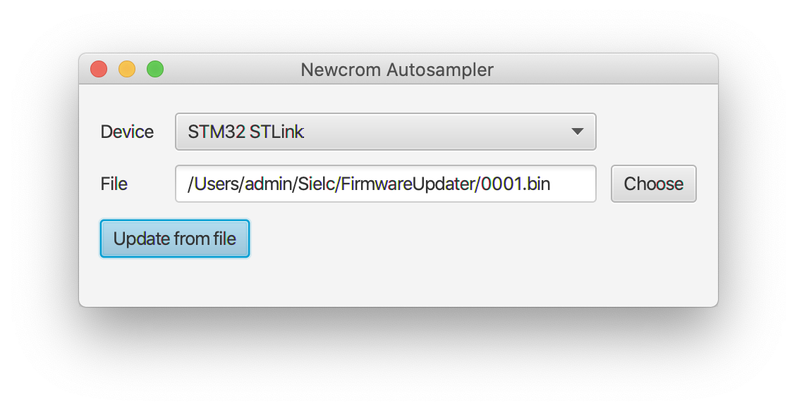

# FirmwareUpdater
Tool to reprogram hardware serial devices via X-Modem protocol

- Download firmwareupdater.jar
- Use Java VM to run it
- Select serial device
- Select 'firmware.bin' binary file to send
- Click 'Update'

[Video](https://youtu.be/8U4GN5SFNHA)
